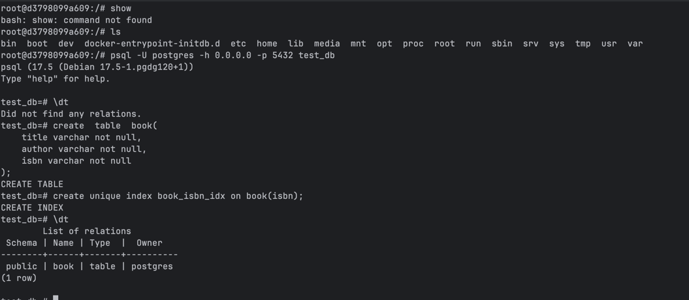

# Rust and sql

This project is to demonstrate how to use Rust with SQL databases using the `sqlx` library.

## tools

- sqlx
- tokio
- postgres

## Getting Started

### Prerequisites

```shell
# start a PostgreSQL server from docker and create a database named `test_db`.
docker-compose up

cargo run -q

```

## using sqlx for migrations

- sqlx looks for migrations in the `migrations` directory by default.
- sql file naming convention is `<version>_<description>.sql`, e.g., `0001_books_table.sql`.
- open docker interactive terminal to check if the migration was successful:

```shell
psql -U postgres -h 0.0.0.0 -p 5432 test_db
\dt
```


